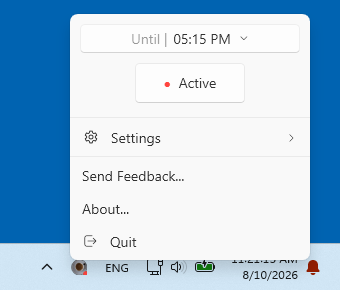
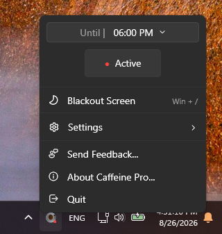
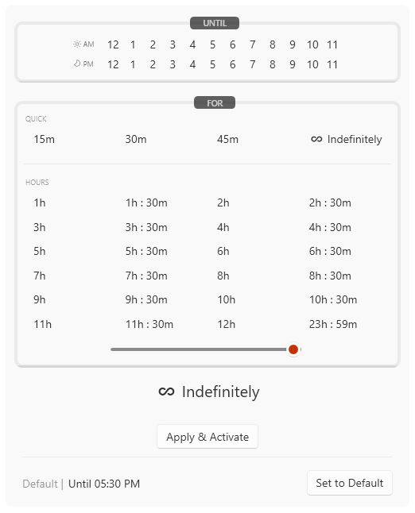
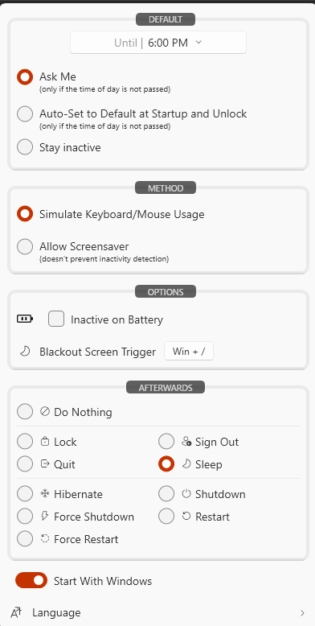
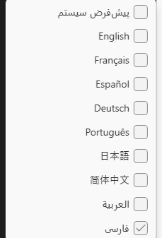

## Caffeine Pro
Caffeine Pro prevents your Windows computer from going to sleep, locking, or showing you as "Away" in
communication apps. It's useful when you need the machine to stay awake but can't change the system-wide
power settings – or don't want to remember to change them back later.

It lives in the notification area (system tray), keeps itself out of the way, and stops on a schedule you choose.

 

Everything runs from the tray menu: the current end time, an Active/Inactive toggle, the blackout screen, and
a Settings flyout. The whole window follows the Windows theme.

## Features

- **Keeps Windows awake** using one of two methods (see [How It Works](#how-it-works)) – either by simulating
  real keyboard/mouse input, or by asking Windows directly while still allowing the screen saver.
- **Timed sessions:** stay awake indefinitely, for a relative duration ("for 2 hours"), or until an absolute
  time of day ("until 5:30 PM") – see [Setting How Long](#setting-how-long).
- **Actions afterwards:** when the timer expires, Caffeine Pro can leave the session alone or perform
  **Lock**, **Sign Out**, **Quit** (the app), **Sleep**, **Hibernate**, **Shutdown**, **Force Shutdown**,
  **Restart**, or **Force Restart**. Anything other than "do nothing" is announced first by a countdown you
  have a minute to cancel – see [The Countdown Before an Action](#the-countdown-before-an-action).
- **Blackout screen:** **Win + /** covers every monitor in black, so the machine looks switched off while it
  carries on working. **Esc** brings the desktop back – see [Blackout Screen](#blackout-screen).
- **Startup behavior:** choose a default awakeness and whether the app should *auto-activate*, *ask you*, or
  *stay inactive* at startup and after each unlock. The "ask me" prompt is a lightweight notification you can
  dismiss for the rest of the day.
- **Returns-to-desk detection:** the app also notices when the display wakes back up after being blanked for
  inactivity – not just session lock/unlock – so it can offer to reactivate when you actually come back.
- **Pause while on battery:** optionally suspend keeping-awake whenever the machine is unplugged. Power source
  changes are detected the moment the charger is pulled, not on the next tick.
- **Pause while locked:** keeping-awake is automatically suspended while the workstation is locked, and resumes
  on unlock.
- **Tray icon reflects state:** distinct icons for active, inactive, and temporarily paused, with the reason
  ("Paused - running on battery", "Paused - workstation locked") shown in the tooltip.
- **Auto start with Windows:** can register itself to launch at sign-in.
- **Nine languages:** English, French, Spanish, German, Portuguese, Japanese, Chinese (Simplified), Arabic and
  Farsi. The interface follows your Windows display language out of the box, or you can pick one from
  **Settings > Language** – see [Languages](#languages).
- **Light/dark theme:** built on the WPF-UI Fluent library; follows the Windows theme and switches live when
  you change it.
- **Single instance:** only one copy runs at a time. Launching a second one detects the first, forwards any
  command-line arguments to it over a named pipe, and exits.
- **Command line control:** activate, deactivate, set a duration, query status, or quit the running instance
  from a script or shortcut.

## Setting How Long

Clicking the time button at the top of the tray menu opens the picker.



**UNTIL** takes an absolute time of day; the hour you pick stays absolute, so the end time doesn't drift by
however long you spend deciding. **FOR** takes a duration – quick presets, a half-hour grid running to
23h 59m, a slider for anything in between, or **Indefinitely**. The current choice is spelled out above
**Apply & Activate**, and **Set to Default** loads whatever you configured as the startup default (shown
beside it) back into the picker.

## Blackout Screen

**Win + /** blacks out every monitor – no wallpaper, no cursor, nothing – so the machine looks switched off
while it carries on working. **Esc** brings the desktop back, and pressing the shortcut a second time does the
same. It is also in the tray menu as **Blackout Screen**, with the current shortcut shown beside it.

Nothing is suspended while the screen is black: downloads, builds and calls carry on, and Caffeine Pro keeps
doing whatever it was doing. It is a curtain, not a power state.

To change the shortcut, click the key combination beside **Blackout Screen Trigger** under **Settings →
Options** and press the one you want. Recording uses a low-level keyboard hook, so combinations Windows
normally keeps for itself – **Win + /**, **Win + D** and the like – can be captured, and pressing them while
recording does not also trigger what they usually do. Windows requires at least one modifier, and refuses a
combination another application has already registered; the settings panel says so when that happens.
Backspace clears the shortcut, which leaves the menu item as the only way in, and Escape cancels.

## The Countdown Before an Action

When a session ends with an afterwards action set, the action does not fire straight away. Every monitor is
covered with a blurred, dimmed snapshot of your desktop, and a one-minute countdown appears centered on your
main display, offering **+5 min**, **+10 min**, **+20 min**, **+30 min**, **+1 hour** and **Cancel**. Escape
cancels it too. Adding time reactivates the session for that long instead of running the action. If nothing is
pressed before the countdown reaches zero, the action runs.

Both this and the blackout screen take the keyboard focus when they appear, so Escape works without having to
click them first.

## System Requirements

- Windows 10 version 1809 (build 17763) or later, x86 / x64 / ARM64.
- Nothing else. Both the Store package and the standalone executable bundle the .NET 10 runtime,
  so neither needs .NET installed – Windows ships no .NET Core runtime in the box.

## Installation

Grab a build from the [releases page](https://github.com/fsol11/CaffeinePro/releases), or build from
source:

```
git clone https://github.com/fsol11/CaffeinePro.git
cd CaffeinePro
dotnet build CaffeinePro.sln -c Release
```

### Packaging

Caffeine Pro ships as an MSIX package, built by the `CaffeinePro Setup` project. The `scripts` folder
wraps the whole release path, and each script can be run from anywhere:

| Script | Purpose |
| --- | --- |
| `scripts\publish-store.bat` | Builds the x86 / x64 / ARM64 bundle and the `.msixupload` for Partner Center. |
| `scripts\test-package.ps1` | Builds one architecture, installs it, and launches it, so you can test the packaged app locally. `-Uninstall` removes it again. |
| `scripts\submit-store.ps1` | Creates a Store submission and uploads the `.msixupload` through the Store submission API. Stages only, unless you pass `-Commit`. |
| `scripts\publish.bat` | Separate from the Store path: produces the signed standalone executable for the releases page. |

`test-package.ps1` needs Developer Mode (Settings → System → For developers) but no certificate and no
administrator rights.

`submit-store.ps1` reads its Partner Center credentials from `scripts\.env`. Copy
`scripts\.env.example` to `scripts\.env` and fill in the three values:

```
PARTNER_TENANT_ID=...
PARTNER_CLIENT_ID=...
PARTNER_CLIENT_SECRET=...
```

`.env` is gitignored and must stay that way — the secret in it can publish under your company's
identity. If it is ever committed, rotate it in Partner Center. When `.env` is absent the script
falls back to real environment variables, which is what a CI runner would supply.

To confirm the credentials work without creating anything, run `scripts\submit-store.ps1 -CheckOnly`.
It authenticates, reports the product's pending and last-published submissions, and stops.

## How It Works

There are two methods to keep Windows active, each with its own trade-off. You pick one under **Settings →
Method**.

### 1. Simulate keyboard and mouse usage (default)

Caffeine Pro sends real input events through `SendInput`, alternating randomly between pressing **F14**,
pressing **F15** (neither is present on a normal keyboard, so nothing in your applications reacts to them), and
nudging the mouse one pixel around a tiny square that returns the cursor to where it started.

Because these are genuine input events, they update `GetLastInputInfo` – which is what Microsoft Teams, Slack
and similar apps use to decide you're away. This method therefore keeps you shown as *available*. The trade-off
is that it also prevents the screen saver from ever starting.

Two details make it behave well in practice:

- **It only fires when you're actually idle.** A low-level keyboard/mouse hook tracks your real activity, and
  the signal is skipped entirely if you've touched the machine since the last tick.
- **The interval is randomized** between roughly 35 and 120 seconds on every tick, rather than being a fixed
  cadence.

```cs
public static void SendKeepAwakeSignal()
{
    switch (_random.Next(3))
    {
        case 0:
            PressF14();
            break;
        case 1:
            PressF15();
            break;
        default:
            MoveMouseSquare();
            break;
    }
}
```

### 2. Allow screen saver

In this mode no input is simulated. Instead the app tells Windows that the system is required, using
`SetThreadExecutionState`:

```cs
[DllImport("kernel32.dll", CharSet = CharSet.Auto, SetLastError = true)]
private static extern uint SetThreadExecutionState(uint esFlags);

private const uint EsContinuous     = 0x80000000;
private const uint EsSystemRequired = 0x00000001;

SetThreadExecutionState(EsContinuous | EsSystemRequired);
```

The machine stays awake and the screen saver is still free to start, but `SetThreadExecutionState` does **not**
update `GetLastInputInfo` – so communication apps will still mark you as Away after a while.

Whenever the app is deactivated or paused, the execution state is released with `ES_CONTINUOUS` alone so
Windows resumes managing sleep normally.

## Command Line

```
Usage: CaffeinePro [Command] [options]

Commands:
    activate            activate (default)
    activeForX          activate for X minutes
    activeUntilX        activate until X (X = hh:mmtt)
    deactivate          deactivate the running instance
    exit | quit         exit the running instance

Options:
  -help                 show help
  -status               show the current status
  -allowss              allow screen saver (no keyboard/mouse simulation)
  -inactiveOnBattery    pause while running on battery
```

If an instance is already running, the arguments are forwarded to it through a named pipe and the new process
exits immediately – so `CaffeinePro.exe deactivate` from a script controls the copy already in your tray.

## Settings

Everything lives in one panel, reached from **Settings** in the tray menu.



**Default** is the awakeness applied at startup and after each unlock, together with how assertive the app
should be about it. **Method** chooses between the two keep-awake techniques described above. **Options**
holds the battery pause and the [blackout screen](#blackout-screen) shortcut. **Afterwards** is the action to
run when the timer expires. Below the panel sit **Start With Windows** and **Language** – see
[Languages](#languages).

Settings are stored per user as JSON at:

```
%AppData%\CaffeinePro\CaffeineProConfig.json
```

They are written immediately whenever a setting changes, so there is no explicit "save" step.

## Languages

The interface ships in English, French, Spanish, German, Portuguese, Japanese, Chinese (Simplified), Arabic
and Farsi. **Settings > Language** lists them, each written in its own script, plus **System Default** –
the initial setting, which follows your Windows display language and falls back to English for anything
Caffeine Pro does not speak.



The list above is that menu with the app running in Farsi. The layout is mirrored, so the check mark against
the current language sits on the right rather than the left – as do the icons, and the arrows on the items
that open a submenu, which point left toward where the submenu appears.

Switching takes effect immediately: every window, menu and tooltip is rebound rather than reloaded, so there
is nothing to restart. Alongside the text, the language also decides:

- **Reading direction.** Arabic and Farsi mirror the entire layout – menus, buttons, and dialogs – while
  logos and photos are held upright so they are not flipped with it. Directional icons drawn from an icon
  font are a special case: `FlowDirection` mirrors layout and vector art but not glyphs, so the submenu
  chevron is turned round explicitly (`LocalizationService.MirrorTransform`).
- **Font.** Each script gets a stack that actually covers it (Segoe UI for Arabic and Farsi, Yu Gothic UI for
  Japanese, Microsoft YaHei UI for Chinese). The Latin languages share one stack, so moving between them
  never changes how the app looks.
- **Dates, times and numbers.** These are formatted with the chosen language's own conventions rather than a
  fixed pattern, so 12- and 24-hour cultures each read naturally. Arabic and Farsi also get their own digits
  (`٦:٠٠`, `۱۸:۰۰`) rather than 0-9 — see the note below.

### A note on digits

Getting Arabic and Farsi numbers right takes two mechanisms, because neither one covers everything:

- Text written directly in XAML, and numbers bound straight from a property, are drawn in native digits by
  WPF itself. The window and menu roots ask for this with `NumberSubstitution.Substitution`. Left to its
  default WPF would either do nothing (its number culture comes from `xml:lang`, which stays `en-US`) or
  shape each digit from whatever character precedes it — which leaves a number at the start of a string
  Latin and the same number mid-sentence native.
- Text this app *builds* in C# — durations, clock times, anything with a number formatted into it — arrives
  as 0-9, because .NET never emits native digits. `LocalizationService.ToNativeDigits` converts it on the way
  to the screen.

The two compose safely: substitution only ever maps 0-9, so it leaves already-converted digits alone.

Text that doubles as a value is the exception: the picker's hour buttons keep plain 0-9 in `HourItem.HourLabel`
and are drawn in native digits by WPF, while the time each button actually means travels beside it as a number
(`HourItem.Hour24`). That is the pattern to follow — keep the value in the data and let the label be whatever
the language needs, rather than parsing a label back and hoping its digits are still 0-9.

Every clock time in the app goes through `Routines.FormatClockTime`, which builds one string from the
translated `TimeSlider_ClockFormat`. That format carries the wording *and* the word order, so each language
decides where the AM/PM marker sits in the string: after the time in English and the other Latin languages
and in Arabic and Farsi, in front of it in Japanese and Chinese (`午後6:05`).

Where the marker *appears* is a separate question from where it sits in the string, and in a right-to-left
language the two are opposites: the last thing in the string is drawn leftmost. So Arabic and Farsi keep the
marker last and let the mirrored layout put it on the left, which is why the format for those two reads the
same as English. Forcing the label left-to-right instead — the obvious first guess — changes nothing, because
the marker and the digits beside it form a single right-to-left run that gets reversed either way.

What does matter is that the time travels as **one string**. Split across separate runs, the bidirectional
algorithm reorders each piece on its own and the time comes out scrambled (`PM 00: 6`); as one string it is
laid out as a unit, the digits keep their order, and the marker lands on the correct side.

Times are always shown on a **12 hour clock**, in every language — including the ones that would normally use
a 24 hour clock. The picker they come from is built around AM and PM (two rows of twelve hours), so a summary
underneath it reading "18:00" would describe the same choice in a different system. To give a language its 24
hour clock back, `FormatClockTime` is the one place to change.

### Adding or changing a translation

All text lives in `CaffeinePro/Resources/Strings.resx` (English, with a note on each entry explaining where
it appears) and one `Strings.<language>.resx` beside it per language. XAML pulls a string in with
`{loc:Loc SomeKey}` and C# with `LocalizationService.Get("SomeKey")`; both go through the same table, which
is what lets the language change without a restart.

Nothing at build time notices a key that was added to English and forgotten elsewhere – the app just falls
back to English. Run the checker after touching any `.resx`:

```
pwsh Scripts\check-localization.ps1
```

It reports keys missing from a translation, keys that no longer exist in English, and – the one a fallback
would not save you from – a translated `{0}` placeholder that was dropped or renamed.

To add a language, add its `.resx` and one entry to `LocalizationService.Languages` — its code, its own name,
whether it reads right to left, whether it writes numbers in its own digits, and its font stack — then list it
in `CaffeinePro Setup/Package.appxmanifest` under `<Resources>` so packaged builds recognise it.

### How a language change reaches the screen

Most text refreshes itself: `{loc:Loc}` produces a binding onto `LocalizationService`, which announces its
indexer, so every one of those updates at once. Text produced by a *converter* does not — a duration or a
clock time is built from a source that has not changed, so the binding has no reason to re-evaluate.
`UiRefresher` closes that gap by walking what is on screen and asking each binding to read its source again.

Two things about that walk are easy to get wrong, and both cost real bugs:

- It enumerates the **type's** dependency properties, not the element's local values. A binding that came from
  a `DataTemplate`, `ControlTemplate` or `Style` setter is not a local value, and a local-value walk silently
  skips it — which is exactly how the picker's item labels are bound.
- It descends into `ContextMenu`, `ToolTip` and `DropDownButton.Flyout`. Those hang off a property rather than
  sitting in the visual or logical tree, so an ordinary walk never reaches them. The time picker lives in a
  flyout, and without this it kept the language *and the reading direction* it was last opened with.

## Project Layout

| Path | Contents |
| --- | --- |
| `CaffeinePro/Services` | `KeepAwakeService` (core timer and state), `WindowsSessionService` (lock/unlock, session actions), `SystemActivityService` (display power and AC/battery notifications), `SingletonService` (mutex + named pipe), `HotKeyService` (system-wide shortcut registration) |
| `CaffeinePro/Classes` | `AppSettings`, `Awakeness` (the "until when" model), `HotKey` (a shortcut and how it is stored and shown), `KeyMouseSimulator`, `WindowsKeyboardMouseCapture`, `HotKeyRecorderHook` (captures a shortcut being recorded), `ScreenInfo` / `WindowPlacement` (per-monitor placement and focus for the full-screen overlays), command-line processing |
| `CaffeinePro/Windows` | `NotificationWindow` (the "keep awake?" prompt) and its `NotificationWindowBase`, `AfterwardsActionWarningWindow` (the countdown), `BlackoutWindow`, `HotKeyRecorderWindow`, `AboutWindow` |
| `CaffeinePro/Controls` | Tray/settings UI: time slider, awakeness view, startup options, status |
| `CaffeinePro/Converters` | WPF value converters used by the XAML |
| `CaffeinePro/Localization` | `LocalizationService` (the string table, reading direction, script font and digits), `LocExtension` (the `{loc:Loc}` XAML markup extension), `AppLanguage` (one entry of the language menu), `UiRefresher` (re-reads the bindings a language change cannot reach on its own) |
| `CaffeinePro/Resources` | `Strings.resx` and one `Strings.<language>.resx` per language, plus the icons and images |
| `CaffeinePro Setup` | MSIX packaging project: manifest, Store visual assets, packaging settings |

## License

Caffeine Pro is licensed under the MIT License. See [LICENSE.txt](LICENSE.txt).

Copyright (c) 2026 Lotrasoft Inc.
